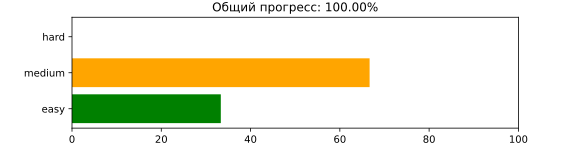

# 📊 Прогресс решения задач

| #  | Задача       | Уровень | Решено |
|----|-------------|---------|--------|
| 1  | [Two Sum](problems/easy/two-sum/README.md) | 🟢 Лёгкая | ✅ |
| 2  | [Add Two Numbers](problems/medium/add-two-numbers/README.md) | 🟠 Средняя | ✅ |
